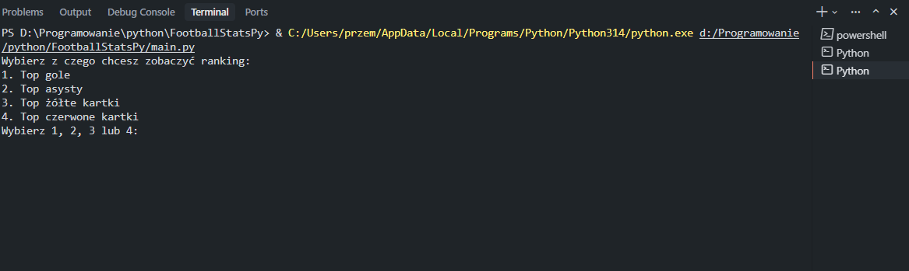
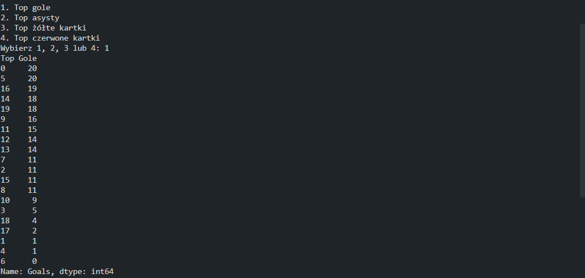
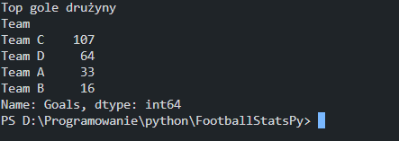

# FootballStatsPy

Aplikacja do analizy statystyk piłkarskich napisana w Pythonie. Program umożliwia wyświetlanie rankingów graczy i drużyn w kategoriach: gole, asysty, żółte kartki oraz czerwone kartki.

## 📋 Opis

FootballStatsPy to narzędzie do analizy danych piłkarskich, które pozwala na:
- Wyświetlanie rankingów graczy według różnych statystyk
- Wyświetlanie statystyk drużyn
- Interaktywny wybór kategorii do analizy
- Sortowanie danych w porządku malejącym

## 🚀 Wymagania

- Python 3.7+
- pandas
- numpy

## 📦 Instalacja

1. Sklonuj repozytorium lub pobierz pliki projektu:
```bash
git clone github.com/przemekradomski/FootBallStatsPy
cd FootballStatsPy
```

2. Zainstaluj wymagane biblioteki:
```bash
pip install pandas numpy
```

Lub użyj pliku requirements.txt (jeśli istnieje):
```bash
pip install -r requirements.txt
```

## 💻 Użycie

1. Upewnij się, że plik z danymi znajduje się w katalogu `data/sports_data.csv`

2. Uruchom program:
```bash
python main.py
```

3. Wybierz kategorię z menu:
   - `1` - Top gole
   - `2` - Top asysty
   - `3` - Top żółte kartki
   - `4` - Top czerwone kartki

4. Program wyświetli rankingi zarówno dla graczy, jak i drużyn.

## 📁 Struktura projektu

```
FootballStatsPy/
│
├── main.py                 # Główny plik uruchomieniowy
├── README.md               # Dokumentacja projektu
├── data/
│   └── sports_data.csv     # Plik z danymi piłkarskimi
├── utils/
│   ├── __init__.py
│   ├── player_analysis.py  # Funkcje analizy statystyk graczy
│   └── team_analysis.py    # Funkcje analizy statystyk drużyn
├── scripts/
│   └── print_datas.py      # Funkcje wyświetlania danych
└── screenshots/             # Folder na screenshoty (opcjonalny)
    ├── menu.png
    ├── top_goals_players.png
    ├── top_goals_teams.png
    └── ...
```

## 📊 Format danych

Plik CSV powinien zawierać następujące kolumny:
- `Player` - Nazwa gracza
- `Team` - Nazwa drużyny
- `Goals` - Liczba goli
- `Assists` - Liczba asyst
- `Matches_Played` - Liczba rozegranych meczów
- `Yellow_Cards` - Liczba żółtych kartek
- `Red_Cards` - Liczba czerwonych kartek
- `Minutes_Played` - Liczba rozegranych minut

## 🔧 Funkcjonalności

### Analiza graczy
- Ranking graczy według liczby goli
- Ranking graczy według liczby asyst
- Ranking graczy według liczby żółtych kartek
- Ranking graczy według liczby czerwonych kartek

### Analiza drużyn
- Statystyki drużyn według goli
- Statystyki drużyn według asyst
- Statystyki drużyn według żółtych kartek
- Statystyki drużyn według czerwonych kartek

## 📝 Przykład użycia

```
Wybierz z czego chcesz zobaczyć ranking:
1. Top gole
2. Top asysty
3. Top żółte kartki
4. Top czerwone kartki
Wybierz 1, 2, 3 lub 4: 1

Top Gole
Player 1    20
Player 6    20
Player 17   19
...

Top gole drużyny
Team C    20
Team D    19
...
```

## 📸 Screenshoty

> **Uwaga:** Aby dodać screenshoty, utwórz folder `screenshots/` w głównym katalogu projektu i umieść tam pliki PNG/JPG zgodnie z nazwami poniżej.

### Menu główne

*Menu wyboru kategorii statystyk*

### Ranking graczy - Top gole

*Ranking graczy według liczby strzelonych goli*

### Ranking drużyn - Top gole

*Ranking drużyn według sumy strzelonych goli*


## 🛠️ Technologie

- **Python** - język programowania
- **pandas** - biblioteka do analizy danych
- **numpy** - biblioteka do obliczeń numerycznych

## 📄 Licencja

Ten projekt jest dostępny do użytku osobistego i edukacyjnego.
Możesz go dowolnie modyfikować i rozbudowywać

## 👤 Autor
Przemysław Radomski
Projekt stworzony w celach edukacyjnych do analizy statystyk piłkarskich.


